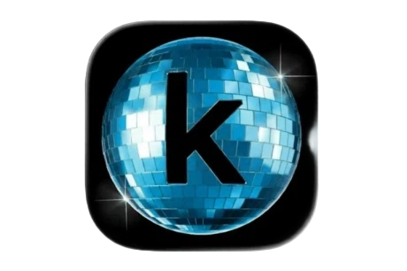

<p align="center">
  
</p>

<h1 align="center">KaggleBar</h1>

<p align="center">
  GPU quota, accounts, and running sessions — in your menu bar.
</p>

<p align="center">
  <a href="https://github.com/mmohammadi9812/KaggleBar/actions/workflows/ci.yml"></a>
  
  
  
</p>

---

A tiny native SwiftUI menu bar app that shows your Kaggle GPU/TPU quota at a glance, lets you switch accounts with one click, and monitors active and recent notebook kernels. No Electron, no daemons, no telemetry. Just a ~1 MB binary.

## Install

```sh
brew tap mmohammadi9812/tap
brew install --cask kagglebar
```

Or [download the latest DMG](https://github.com/mmohammadi9812/KaggleBar/releases/latest/download/KaggleBar.dmg) and drag to Applications.

## Build from source

Requires Xcode Command Line Tools (`xcode-select --install`).

```sh
git clone https://github.com/mmohammadi9812/KaggleBar.git
cd KaggleBar
./build.sh          # build, bundle, and launch
./build.sh --dmg    # also produce KaggleBar.dmg
```

> Requires [`create-dmg`](https://github.com/create-dmg/create-dmg) for the `--dmg` flag (`brew install create-dmg`).

## Features

- **Live quota** — GPU and TPU hours remaining with slim progress bars and a weekly reset countdown
- **Account switching** — one click writes the active credentials to `~/.kaggle/kaggle.json` (`0600`), so your terminal `kaggle` CLI and Python SDK switch immediately
- **OAuth aware** — picks up sessions from `kaggle auth login` automatically, no extra setup
- **Kernels list** — shows active/running notebooks and recently executed kernels with relative run times and status indicators; click any kernel to open it directly
- **Menu bar label** — choose between GPU quota, username, both, or icon only
- **Launch at login** — native `SMAppService` with a LaunchAgent fallback

## Credits

Logo by [Megan Risdal](https://twitter.com/MeganRisdal).

## License

[MIT](LICENSE)
